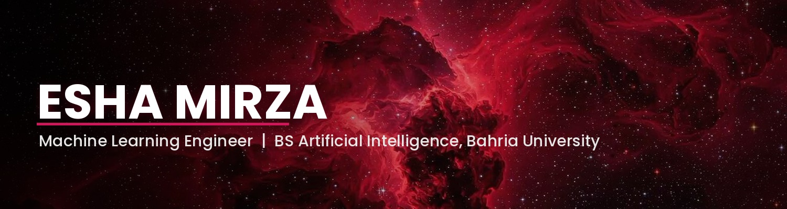

<picture>
  <source media="(prefers-color-scheme: dark)" srcset="https://readme-typing-svg.demolab.com/?lines=Esha+Mirza;AI%2FML+Engineer+in+the+making;Building+systems%2C+not+just+models;Design-brained%2C+code-hearted&font=Fira+Code&size=22&pause=1000&color=D41451&background=0D0D0D00&center=true&vCenter=true&width=600&height=50">
  
</picture>

 

 

## About Me
<!--#about-me-->

<table>
<tr>
<td width="60%" valign="top">

I'm a final-year BS Artificial Intelligence student at Bahria University, and I've spent the last while treating "I built something" as the minimum bar, not the finish line.

During my AI/ML internship at **School of AI**, I shipped **25 end-to-end AI applications** — healthcare, legal tech, finance, NLP, multi-agent systems — and the pattern that kept repeating was the same one every time: the model is the easy part. The hard part is everything around it — the pipeline that doesn't fall over, the interface someone who isn't me can actually use, the documentation that means I'm not the only person who understands my own repo six months later.

Right now I'm going deeper on **CNNs and deep learning fundamentals**, because I'd rather understand *why* a model works than just know it does.

The unlikely part of my week: I also intern on the **design track at Rakh**, a Pakistani streetwear label. It's a strange pairing on paper — tensors and typefaces — but it's exactly why I obsess over how this profile *looks* and not just what it says. I think engineering and design are the same instinct pointed at different materials: care about the thing enough to make it legible to someone else.

I'm currently open to **ML Engineering internships and entry-level roles** — if you're building something that needs a person who'll go past the notebook, let's talk.

</td>
<td width="40%" valign="top" align="center">

  

**Quick Facts**

🎓 BS-AI, Bahria University
🧪 AI/ML Intern @ School of AI
📦 25+ shipped AI projects
🧠 Focus: CNNs · NLP · Multi-Agent Systems
🎨 Design Intern @ Rakh
📍 Islamabad, Pakistan

</td>
</tr>
</table>

 

## 🛠️ Tech Stack
<!--#tech-stack-->

 

## 📌 Featured Projects
<!--#featured-projects-->

| Project | Description | Stack |
|---|---|---|
| [**School of AI Internship Portfolio**](https://github.com/Esha-Mirza/School_Of_AI_Internsihp) | 25 end-to-end AI applications spanning healthcare, finance, education, security, and developer tools, with LLM integration and multi-agent systems throughout. | Python · LLMs · NLP |
| [**Hospital Bed Management Analysis**](https://github.com/Esha-Mirza/Hospital-Bed-Management-Staff-and-Patient-Analysis) | Data-driven analysis of hospital bed utilization, staffing, and patient flow to identify inefficiencies in occupancy and staffing allocation. | Python · Pandas |
| [**GenZ Life Simulator**](https://github.com/Esha-Mirza/GenZ-Life-Simulator-ESM) | Interactive life-simulation game modeling social scenarios, digital wellness, and career decisions with branching consequences. | Python |
| [**Road Runner**](https://github.com/Esha-Mirza/Road-Runner-ASM) | ASCII-art car racing game built entirely in x86 Assembly using the Irvine32 library, with obstacle dodging and rising difficulty. | Assembly (MASM) |
| [**ATM System**](https://github.com/Esha-Mirza/ATM-System) | Console-based ATM simulation with file-based storage — account creation, PIN authentication, balance inquiry, and withdrawal limits. | C++ |

 

## 📊 GitHub Stats
<!--#github-stats-->

 

### 💬 Let's build something.
<!--#lets-build-something-->

*Currently open to ML Engineering internships & entry-level roles*

